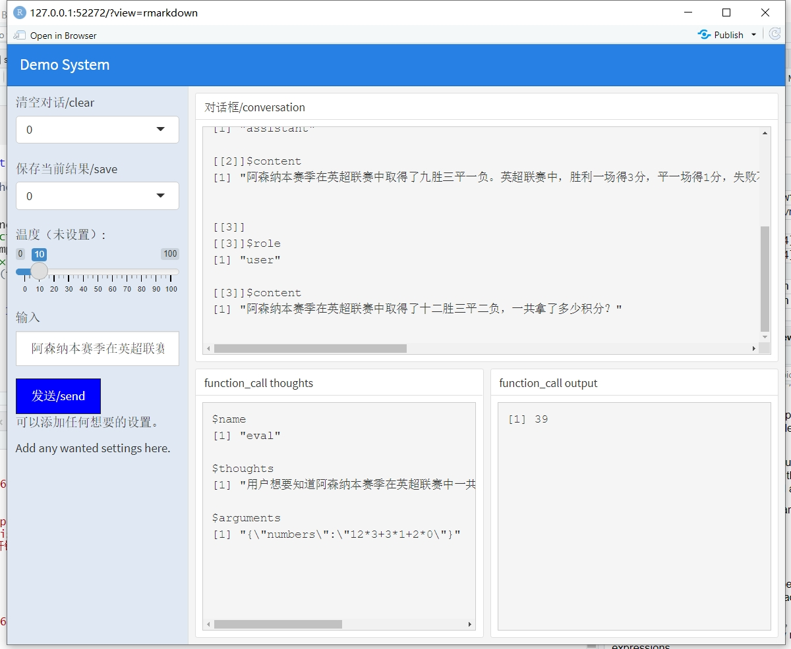

<!-- README.md is generated from README.Rmd. Please edit that file -->

# qianfan API

<!-- badges: start -->
<!-- badges: end -->

Qianfan LLM api. Description for the LLM:
<https://pypi.org/project/qianfan/>.

Most models are not free. This package gives a demo to call Ernie 4.0
model, including multi-round conversation (qf.Rmd) and function calling.

## Installation

<https://github.com/jwwangars/qianfanAPI>.

## Example

This package contains a .Rmd file which generates a website to contact
qianfan LLM. The outcome shows:

## Chinese readme / 中文说明

调用百度千帆大模型的API
demo，由于模型都要钱，只做了对文心4.0模型的接口。本质上与百度智能云平台提供的代码类似，先用两个key，post得到token，然后用这个token附加你要进行对话的json文件再post过去。包里给出的两个函数是单轮对话的，另附的.rmd文件是多轮对话的，由于shiny的限制目前是用的文件存储。

注意不同模型的调用方式不一样，本demo（文心4.0）有function
calling的接口，但百度有的大模型不支持function calling。

另，至23年12月，github的openai R包长期未更新，目前应该没有按最新版openai
ChatGPT版本做适配。我用python正常调用的语句在这个包里调用一直提示连接异常，开梯子换proxy均无效（中国大陆地区）。

最后，文心4.0的function calling真是玄学。
